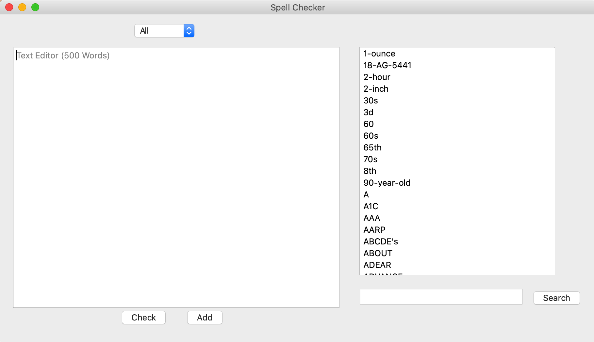
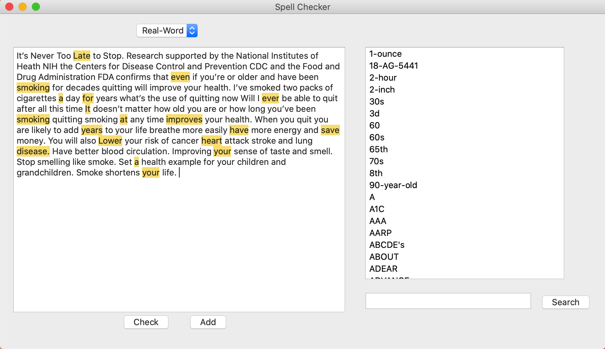
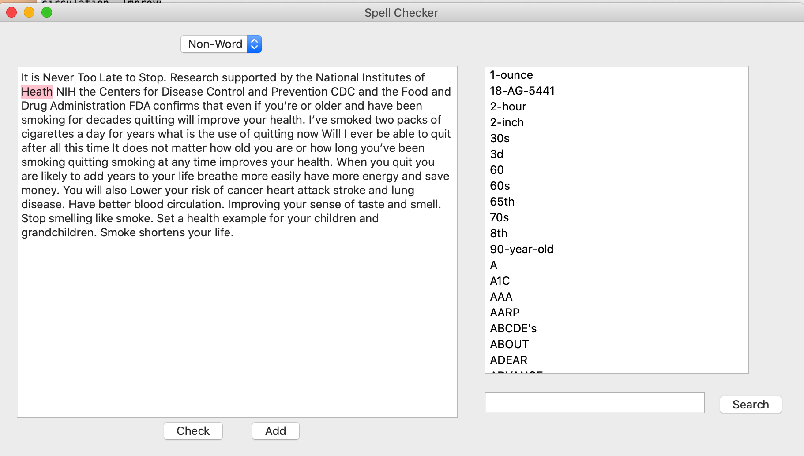

# Spelling-check-word-correction-

# Aim of the study <h2>
The aim of this study is to implement advanced NLP techniques into spell check system which provide  optimal performance on spelling detection ad correction (suggestion of correct words). The spell checker inn this study adopted bigram language model and minimum edit distance approach to solve non-word and real-word spelling errors.

# 研究目标 <h2>
这项研究的目的是在拼写检查系统中引入先进的NLP技术，从而在拼写检测和错词修正（建议正确单词）方面提供最佳性能。
这项研究的拼写检查器采用Unigram 和 Bigram语言模型和最小编辑距离方法来解决非单词和实词的拼写错误。

# System screenshot - system <h2>
  

# System screenshot - detection of real-word problem <h2>

# System screenshot - detection of non-word problem <h2>

  
